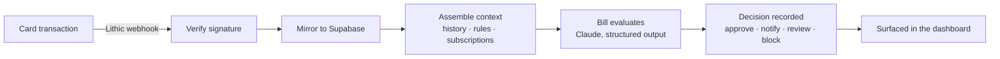

# Bill — a quiet watch on every charge

Bill is a recurring-spend agent. It watches a virtual card for silent price
hikes, charges that don't fit your pattern, and subscriptions you forgot you had
— and only speaks up when there's a real call to make. It **recommends**, it
never seizes: the money and the account always stay under the user's control.

**Live:** [agent-bill.vercel.app](https://agent-bill.vercel.app) · runs against
Lithic **sandbox** and Crossmint **staging** (no real money moves yet).

---

## What it does

- **Detects patterns** in recurring spend across cards, merchants, and cycles.
- **Flags what's off** — a plan whose price crept up, an unfamiliar merchant, a
  subscription you stopped using.
- **Explains and recommends** in plain language, and can suggest a card-level
  action (freeze, flag, cancel a renewal) — always leaving the decision to you.
- **Non-custodial by design** — the wallet is the user's; Bill only ever reads
  its balance for context and never moves funds.
- **Waitlist + admin** — a landing page captures early-access signups, with an
  admin console to review and invite them.

## How it works

Bill runs on the transaction **event** (a webhook), not in the synchronous
card-authorization path, so it can afford to actually think about each charge.



The pipeline is **advisory**: it never freezes a card or cancels a subscription
on its own. Bill may *recommend* an action; executing it is left to the user.

New users are **provisioned** at first sign-in: a Crossmint wallet + a Lithic
virtual card, created idempotently so a retry never double-issues.

## Tech stack

| Layer | Choice |
|---|---|
| Framework | Next.js 16 (App Router), React 19, TypeScript |
| Styling | CSS Modules |
| Data / Auth | Supabase (Postgres, Auth, Row-Level Security) |
| Agent | Anthropic Claude (`claude-opus-4-7`), structured outputs + adaptive thinking |
| Cards | Lithic (virtual card issuance + transaction webhooks) |
| Wallet | Crossmint (non-custodial wallets) |
| Email | Resend (optional — waitlist invites) |
| Hosting | Vercel |

## Project structure

```
app/
  _components/         Landing page + shared UI
  (auth)/             Login / signup (server actions)
  app/                Signed-in product: dashboard, card, settings
  admin/waitlist/     Protected admin console
  api/                Route handlers
    webhooks/lithic/  Transaction webhook → Bill
    provision/        Wallet + card provisioning backstop
    cards/ rules/ subscriptions/ waitlist/
  docs/               Product docs pages
lib/
  agent/              Bill: prompt, evaluate, orchestrator, types
  supabase/           Browser / server / admin clients + types
  lithic/ crossmint/  Thin provider clients
  provisioning/       Wallet + card setup at signup
  email/              Waitlist invites (Resend)
  env.ts              Centralized, validated environment access
supabase/migrations/  SQL schema (0001 → 0004)
proxy.ts              Next.js proxy — session refresh + /admin guard
```

## Running locally

```bash
# 1. Install
npm install

# 2. Configure environment
cp .env.example .env.local     # then fill in the values

# 3. Apply the database schema
#    Run each file in supabase/migrations/ (0001 → 0004) against your
#    Supabase project's SQL editor, in order.

# 4. Run
npm run dev                    # http://localhost:3000
```

### Environment variables

**Required** — Supabase (`NEXT_PUBLIC_SUPABASE_URL`,
`NEXT_PUBLIC_SUPABASE_ANON_KEY`, `SUPABASE_SERVICE_ROLE_KEY`), Anthropic
(`ANTHROPIC_API_KEY`), Lithic (`LITHIC_API_KEY`, `LITHIC_ENVIRONMENT=sandbox`),
Crossmint (`CROSSMINT_API_KEY`, `CROSSMINT_ENVIRONMENT=staging`), and
`ADMIN_EMAILS` for the admin console.

**Set after deploy** — `NEXT_PUBLIC_APP_URL`, `LITHIC_WEBHOOK_SECRET` (from the
Lithic event subscription pointing at your deployed `/api/webhooks/lithic`).

**Optional** — `RESEND_API_KEY`, `WAITLIST_FROM_EMAIL` for waitlist invite
emails. With them unset, the admin console still works; the email step is a
no-op. See [`.env.example`](.env.example) for the full list.

Secrets are never committed — `.env.local` is gitignored; only `.env.example`
(placeholders) is tracked.

## Status & roadmap

Fully wired end-to-end and deployed, running in **sandbox/staging**. Card
authorization simulated → webhook → Bill → decision has been verified in
production.

- Real-money issuing needs a licensed issuer (the Lithic client is a thin
  interface designed to swap to Rain when approved).
- Real-time authorization (Lithic Auth Stream) was deferred: its 3–6s window is
  too tight for full LLM reasoning, so today Bill runs on the event stream.
